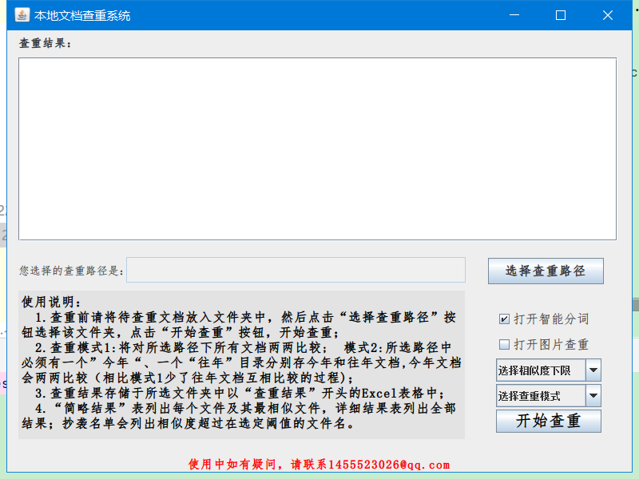

# HomeworkSimilarity

本地作业查重系统。程序入口文件为src/main/java/pers.hdq.ui包中的UIhdq.java 文件。这是一个图形化界面。
如果下载后倒入eclipse后有报错，请在配置构建路径中删除所有jar文件，重新导入项目的lib文件夹中的全部jar文件。

实现对本地某一目录下所有word文档和txt文档进行两两之间的相似度计算。并将完整结果简略结果以及抄袭名单输出为excel文件。  
图片相似度采用PHash算法，文字相似度采用jaccard相似度和余弦相似度结合进行计算。  
程序已经生成了32位和64位exe文件，直接解压后选择作业查重x32和作业查重x64文件夹即可运行（下载链接：链接: https://pan.baidu.com/s/1PA1x786sXzsr0J4cJI5z-A 提取码: umfm）。

详细图文说明也在上面的百度网盘链接中，PPT初步了解，文档3,4章详细介绍系统设计和实现。

**release分支为最新分支**,将所有lib目录中的依赖换为maven依赖;且正常使用idea打开运行.**如果下载后运行发现报ik配置项空指针,尝试将lib目录设置为资源目录**,如下图

